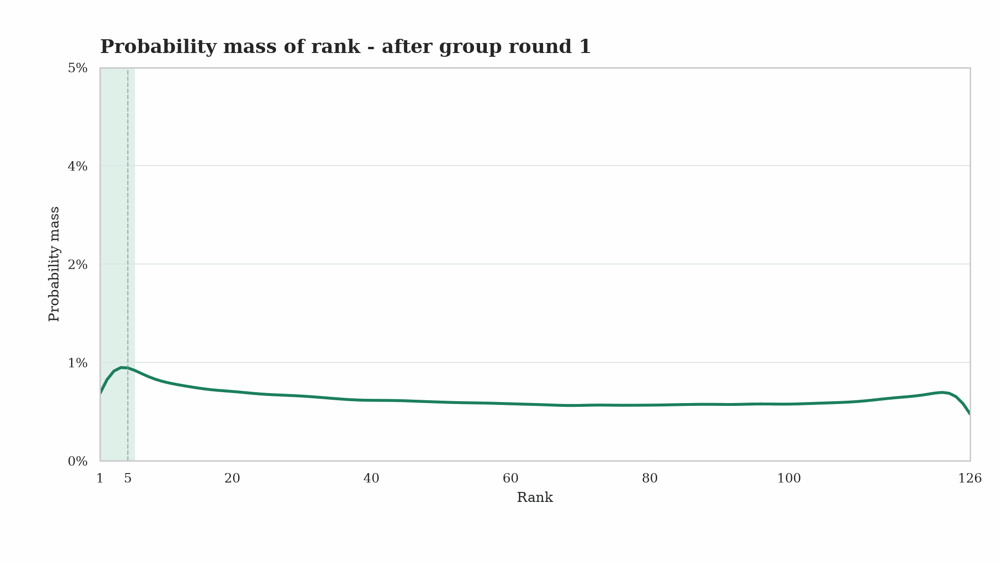
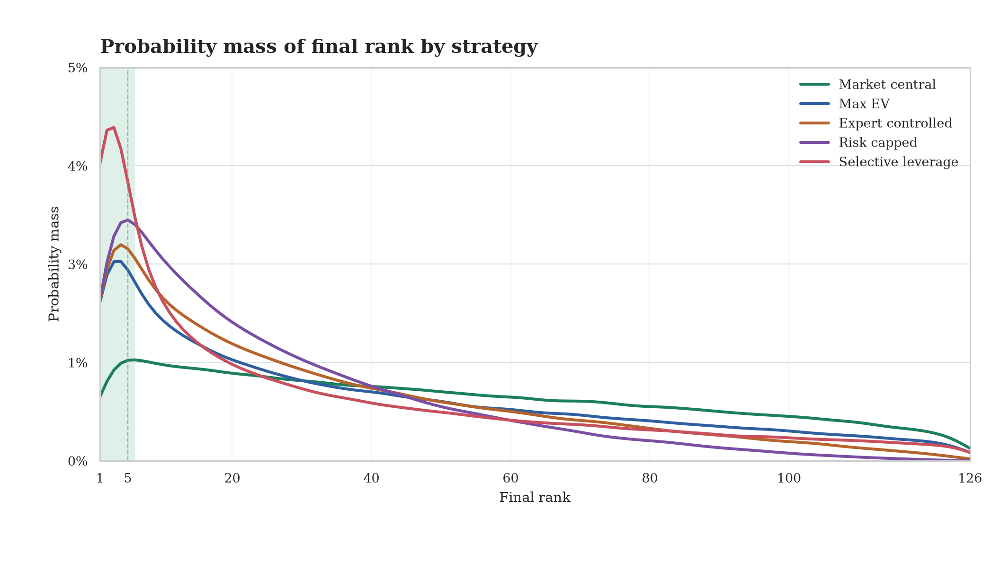
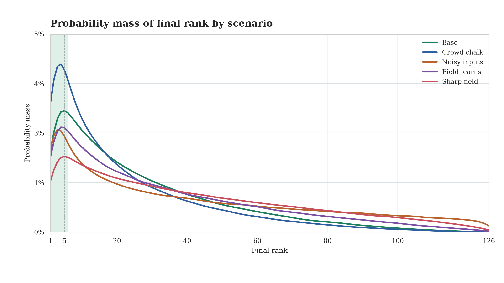

# Win Prediction Tournaments with Strategy Simulation

This repo helps you win prediction tournaments by simulating outcomes, opponents, and payout-aware strategies.

It is built for contests where the objective is a **leaderboard rank**: finish first, reach the paid places, maximize expected payout, or control downside. The examples are **football-oriented**. The method applies to any point-based prediction contest.

## What It Does

The framework turns a tournament into a strategy problem. It models **what can happen**, **what opponents are likely to pick**, and **how each portfolio scores**.

- **Simulate the tournament**: outcomes, opponent picks, scores, leaderboard, payout.
- **Compare portfolios**: safe, top-1, top-X, contrarian, risk-capped.
- **Update live decisions**: lock known results and revalue remaining picks with backward strategy.

The chart below shows a simulated optimized strategy through tournament rounds. Each frame is a **rank probability mass**. More mass on the left means a better chance to finish near the top.



## Objective Function

A portfolio is selected from the gain attached to final rank:

```math
s^* = \arg\max_{s \in S} \mathbb{E}[G(R_s)]
```

`s` is a portfolio. `R_s` is its simulated final rank. `G(rank)` is the payout or utility of that rank.

If the payout rewards **top 5**, the objective targets top-5 probability. If the contest is **winner-take-all**, the objective targets rank 1. If downside matters, `G` can include a risk penalty.

## Modeling The Tournament

The tournament model separates the pieces that drive leaderboard value. This keeps probability, popularity, scoring, and payout from being mixed together.

- **Scoring rules** define how picks become points.
- **Truth probabilities** estimate what is likely to happen.
- **Field probabilities** estimate what other players are likely to pick.
- **Expert signals** adjust assumptions for injuries, lineups, tactics, or context.
- **Leaderboard simulation** combines everything into rank and payout distributions.

```text
rules + probabilities + field + signals + payout
                  -> simulated leaderboard
                  -> ranked strategy portfolios
```

## Modeling Other Players

The **field model** estimates ownership: how often other players choose each pick. This is useful because leaderboard value depends on being correct **and** being positioned well against the crowd.

It can use **market favorites**, **popular score patterns**, **expert narratives**, **current standings**, and **remaining risk appetite**. A correct crowded pick can add little separation. A lower-owned pick can be valuable when its probability is still strong.

## Choosing A Strategy

Strategy selection maps the payout objective to the right risk profile. The same tournament can lead to different portfolios depending on what gets paid.

- **Paid places**: prioritize survival and stable top-X probability.
- **Top 1**: accept more variance for more upside.
- **Top X**: balance ceiling and downside.
- **Risk control**: avoid fragile portfolios with narrow win paths.



## Stress Testing

Stress testing checks whether the portfolio remains strong when assumptions move. It measures robustness across scenario changes and expected value.

Compare scenarios where the **field is chalkier**, probabilities are **noisier**, opponents become **sharper**, expert signals conflict with markets, or downside becomes more expensive.

The goal is to keep strategies that still have good rank distributions across plausible worlds.



## Quickstart

Public example command:

```bash
python examples/basic_football_pool/run_example.py
```

Minimal Python use:

```python
from prediction_framework import run_betting_tournament_strategy

result = run_betting_tournament_strategy(
    options,
    paid_places=10,
    n_sims=10000,
    n_opponents=125,
    seed=42,
)

print(result.strategy_summary)
print(result.recommended_portfolio)
```

`options` is one row per possible pick:

- `event_id`
- `option_id`
- `truth_probability`
- `field_probability`
- `points_if_hit`

Public examples use synthetic inputs. Bring your own market probabilities, expert signals, or field assumptions.

## AI Skillset

This repo is designed as code plus a working skillset for an AI agent and a human bettor.

The agent helps:

- understand the tournament
- source and normalize data
- collect expert signals
- model the field
- simulate tournaments
- build risk-capped portfolios
- adapt the method to another contest

The human keeps judgment on:

- assumptions
- data quality
- signal trust
- final risk appetite

Start with [ai_skills/README.md](ai_skills/README.md).

## Install / Tests

```bash
python -m venv .venv
source .venv/bin/activate
pip install -e ".[dev]"
python -m unittest tests.test_framework tests.test_scoring
```
