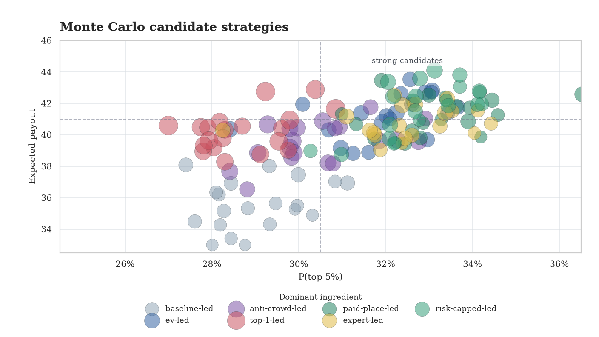
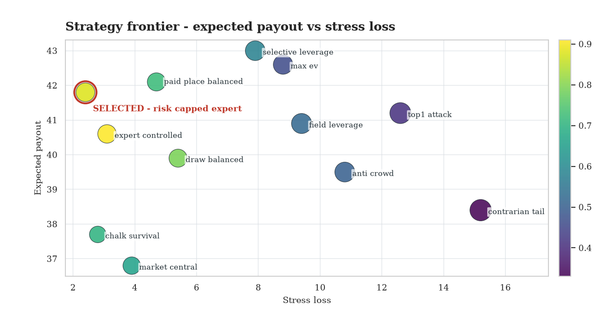

# Optimal Strategy for Prediction Tournaments

This repo helps you win prediction tournaments by simulating outcomes, opponents, and payout-aware strategies.

A prediction tournament pays a **gain by final rank**: rank 1 can pay a lot, paid places can pay smaller amounts, and ranks outside the payout zone usually pay zero. The examples are **football-oriented**. The method applies to any point-based prediction contest.

## What It Does

The framework turns a tournament into a strategy problem. It models **what can happen**, **what opponents are likely to pick**, and **how each portfolio scores**.

- **Simulate the tournament**: outcomes, opponent picks, scores, leaderboard, payout.
- **Compare portfolios**: safe, top-1, top 5%, contrarian, risk-capped.
- **Update live decisions**: lock known results and value remaining picks with backward strategy.

The chart below shows a simulated optimized strategy through tournament rounds. Each frame is a **rank probability mass**. More mass on the left means a better chance to finish near the top.


## Payout Objective

A tournament pays a different share of the pot depending on final rank. For example:

- rank 1: **30%**
- rank 2: **20%**
- rank 3: **15%**
- ranks 4-5: **10%** each
- ranks 6-10: **3%** each
- rank 11+: **0%**

The paid ranks sum to **100%** of the pot. The objective is to choose a portfolio that gives the best expected gain under this payout curve.

In mathematical terms, the tournament defines a gain function over final rank:

```math
G(r) =
\begin{cases}
g_r & \text{if } 1 \le r \le K \\
0 & \text{if } r > K
\end{cases}
```

The target portfolio maximizes expected gain:

```math
s^* = \arg\max_{s \in S} \sum_{r=1}^{K} \mathbb{P}(R_s = r) \cdot g_r
```

`s` is a portfolio, `R_s` is its simulated final rank, and `g_r` is the gain paid at rank `r`.

In practice, the objective mixes **expected payout**, **top 5% probability**, **top-1 upside**, downside control, and expert alignment. The weights depend on the payout curve.

## Modeling The Tournament

The tournament model separates the pieces that drive leaderboard value. Each option has its own probability, expected ownership, and score value.

- **Scoring rules** define how picks become points.
- **Truth probabilities** estimate what is likely to happen.
- **Field probabilities** estimate what other players are likely to pick.
- **Expert signals** adjust assumptions for injuries, lineups, tactics, or context.
- **Leaderboard simulation** combines everything into rank and payout distributions.

```text
event_id: match_1
option_id: team_a_1_0
truth_probability: 0.18
field_probability: 0.27
points_if_hit: 6
```

The simulator samples true outcomes from `truth_probability`, samples opponent picks from `field_probability`, scores every portfolio, ranks the leaderboard, and records payout.

## Modeling Other Players

To model a tournament, the framework also models how the other players bet. The **field model** estimates ownership: how often each option is picked by the crowd.

Concretely, the public model starts from market probabilities: players tend to follow favorites, overweight common scores, react to visible teams, and avoid some lower-owned outcomes. When public picks or historical contests exist, ownership is calibrated from observed data.

This produces `field_probability`, which is separate from `truth_probability`. That separation is what lets the simulator measure crowd leverage.

## Generating Strategy Portfolios

Strategy generation creates a large set of candidate portfolios. In practice, the framework mixes base strategy families with different weights and constraints, then tests every candidate with Monte Carlo simulation.

Each candidate is a portfolio. Each portfolio is scored across simulated tournament worlds: true outcomes, opponent picks, leaderboard ranks, and payout.

The families below are **ingredients**. A generated portfolio can combine several of them. The color in the chart shows the dominant ingredient, so multiple green dots are multiple portfolio variants led by the same idea.

- **Baseline**: market favorite or central probability.
- **EV**: high expected points.
- **Anti-crowd**: probability with field leverage.
- **Top-1**: higher upside and more variance.
- **Paid-place**: stable top 5% probability.
- **Expert-aligned**: reviewed signals influence candidate weights.
- **Risk-capped**: avoids fragile low-probability paths.

For live tournaments, backward strategy locks the current state and values remaining decisions from simulated futures. The public `fit_backward_value_model(...)` function fits continuation values from rollout states with a simple least-squares model.

The chart shows the candidate space after Monte Carlo evaluation. The x-axis is **P(top 5%)**, the y-axis is **expected payout**, and larger points have higher top-1 upside.



## Stress Testing

Stress testing checks whether strong portfolios remain strong when assumptions move. It compares field behavior, probability noise, sharper opponents, expert conflicts, and downside-sensitive payout curves.

The useful output is a frontier of strategies that stay competitive across plausible worlds.

## Selecting The Strategy

After Monte Carlo simulation, the framework keeps the strategies in a near-optimal band, then chooses the one that survives stress tests with lower downside and better expert alignment.

The selection rule is:

1. keep strategies close to the best expected payout or top 5% probability
2. compare stress-test loss across those strategies
3. penalize fragile downside
4. prefer stronger expert alignment
5. pick the least risky strategy among the best candidates

The red ring marks the selected strategy.



## Use The Right Tool

Most workflows start with probabilities, then field modeling, then simulation. Use the smallest function that answers the current question.

| Need | Use |
| --- | --- |
| I have odds or raw probabilities | `build_probability_table(...)` |
| I have multiple sources | `build_source_probability_table(...)` |
| I have expert signals | `audit_expert_signals(...)`, then `apply_expert_signals(...)` |
| I need opponent behavior | `estimate_field_distribution(...)` |
| I need leaderboard distributions | `simulate_leaderboard(...)` |
| I want the best portfolio end-to-end | `run_betting_tournament_strategy(...)` |
| I want risk-controlled picks | `build_risk_capped_portfolio(...)`, then `rank_risk_frontier(...)` |
| I am mid-tournament | `fit_backward_value_model(...)` |

See [docs/function-map.md](docs/function-map.md) for required columns, outputs, and when to avoid each function.

## Quickstart

Public example command:

```bash
python examples/basic_football_pool/run_example.py
```

Minimal Python use:

```python
from prediction_framework import run_betting_tournament_strategy

result = run_betting_tournament_strategy(
    options,
    paid_places=10,
    n_sims=10000,
    n_opponents=125,
    seed=42,
)

print(result.strategy_summary)
print(result.recommended_portfolio)
```

`options` is one row per possible pick:

- `event_id`
- `option_id`
- `truth_probability`
- `field_probability`
- `points_if_hit`

Public examples use synthetic inputs. Bring your own market probabilities, expert signals, or field assumptions.

## AI Skillset

This repo is designed as code plus a working skillset for an AI agent and a human bettor.

The agent helps:

- understand the tournament
- source and normalize data
- collect expert signals
- model the field
- simulate tournaments
- build risk-capped portfolios
- adapt the method to another contest

The human keeps judgment on:

- assumptions
- data quality
- signal trust
- final risk appetite

Start with [ai_skills/README.md](ai_skills/README.md).

## Install / Tests

```bash
python -m venv .venv
source .venv/bin/activate
pip install -e ".[dev]"
python -m unittest tests.test_framework tests.test_scoring
```
