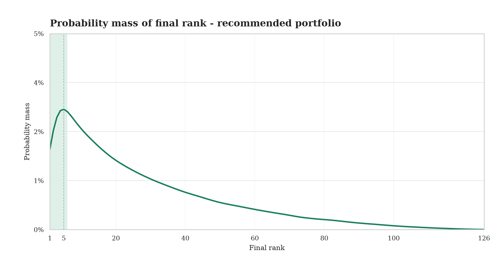

# Prediction Tournament Strategy Framework

Choose picks for a prediction tournament.

The goal is not only to be right. The goal is to beat the leaderboard under the payout rules.

This framework helps you:

- model the tournament rules
- estimate outcome probabilities
- estimate what other players will pick
- run Monte Carlo simulations
- compare strategies by rank distribution
- avoid strategies that win rarely but fail too often

Main question:

> Which portfolio gives me the best chance to finish where the payout matters?

## Monte Carlo Simulation

Each simulation:

- samples tournament outcomes
- scores your portfolio
- scores simulated opponents
- ranks the leaderboard
- records your final rank

The GIF shows rank distributions through tournament rounds.

More mass on the left = better chance of finishing near the top.


Regenerate charts:

```bash
python scripts/generate_readme_charts.py
```

## Pipeline

1. **Tournament**: questions, matches, scoring, bonuses, paid places.
2. **Probabilities**: market odds, model probabilities, manual assumptions.
3. **Field**: what other players are likely to pick.
4. **Expert signals**: injuries, lineups, tactical notes.
5. **Monte Carlo**: outcomes, opponents, scores, ranks, payouts.
6. **Backward logic**: lock known results, value future decisions.
7. **Objective**: paid places, top 1, top X, payout, risk.

## Example Output

A strategy is judged by rank distribution.



Compare strategies:


Stress-test assumptions:


## Quickstart

Run the public example:

```bash
python examples/basic_football_pool/run_example.py
```

Minimal Python use:

```python
from prediction_framework import run_betting_tournament_strategy

result = run_betting_tournament_strategy(
    options,
    paid_places=10,
    n_sims=10000,
    n_opponents=125,
    seed=42,
)

print(result.strategy_summary)
print(result.recommended_portfolio)
```

`options` is one row per possible pick:

- `event_id`
- `option_id`
- `truth_probability`
- `field_probability`
- `points_if_hit`

## AI Skillset

This repo is meant to be used with an AI agent and a human bettor.

The agent helps structure the work:

- understand the tournament
- source market data
- collect expert signals
- model the field
- run simulations
- build risk-capped portfolios
- adapt the method to another contest

The human keeps judgment on:

- assumptions
- data quality
- expert signals
- final risk appetite

Start with [ai_skills/README.md](ai_skills/README.md).

## Install

```bash
python -m venv .venv
source .venv/bin/activate
pip install -e ".[dev]"
```

For README chart generation:

```bash
pip install -e ".[docs]"
```

## Tests

```bash
python -m unittest tests.test_framework tests.test_scoring
```
